<p align="center">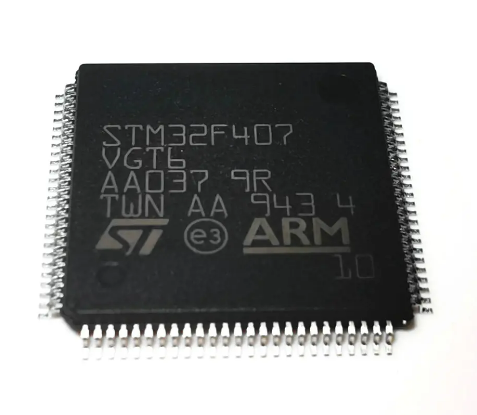</p>
<h1 align="center"> STM32F4 </h1> 
<h4 align="right">Sep 26</h4>

<p>
  
  
  
</p>

<br>

# Table of contents
- [Table of contents](#table-of-contents)
- [Install Softwares](#install-softwares)
  - [Install oficial software STMicroelectronics](#install-oficial-software-stmicroelectronics)
  - [Install Framework for VScode](#install-framework-for-vscode)
    - [Install STM32CubeIDE for VScode](#install-stm32cubeide-for-vscode)
    - [Install PlatformIO IDE for VScode](#install-platformio-ide-for-vscode)
- [Getting Started](#getting-started)
  - [MCUDev DevEBox STM32F407VGT6 (MCU a Flashear)](#mcudev-devebox-stm32f407vgt6-mcu-a-flashear)
  - [STM32CubeMX](#stm32cubemx)
  - [Output STM32CubeMX](#output-stm32cubemx)
    - [Archivos de compilación (CMake)](#archivos-de-compilación-cmake)
    - [Codigo](#codigo)
    - [Código de ST (normalmente no se toca)](#código-de-st-normalmente-no-se-toca)
    - [Configuración del hardware](#configuración-del-hardware)
    - [La regla más importante](#la-regla-más-importante)
  - [STM32CubeMX configuraciones importantes](#stm32cubemx-configuraciones-importantes)
- [Compilation](#compilation)
  - [Cambiar el nombre del ejecutable](#cambiar-el-nombre-del-ejecutable)
  - [Output .elf | .hex | .bin en la compilación](#output-elf--hex--bin-en-la-compilación)
- [How to STM32F407VGT6 Flashear](#how-to-stm32f407vgt6-flashear)
  - [Programación por USB (bootloader DFU sin el programador ST-LINK) (Opcion 1)](#programación-por-usb-bootloader-dfu-sin-el-programador-st-link-opcion-1)
    - [Bootloader DFU \& STM32CubeProgrammer (Flashing via DFU)](#bootloader-dfu--stm32cubeprogrammer-flashing-via-dfu)
    - [Formatos de archivo para flashear con STM32CubeProgrammer](#formatos-de-archivo-para-flashear-con-stm32cubeprogrammer)
      - [Recomendado: usar el `.elf`](#recomendado-usar-el-elf)
      - [Cuándo usar los otros formatos](#cuándo-usar-los-otros-formatos)
    - [Bootloader DFU \& Terminal (Flashing via DFU)](#bootloader-dfu--terminal-flashing-via-dfu)
    - [En caso de Error](#en-caso-de-error)
  - [Usar el programador STlinkV2 original / ARM\_KEIL-uVision (Opcion 2)](#usar-el-programador-stlinkv2-original--arm_keil-uvision-opcion-2)
  - [Usar Zadig (Opcion 3)](#usar-zadig-opcion-3)
- [Guía de conceptos: STM32, HAL, CubeMX, FreeRTOS y más](#guía-de-conceptos-stm32-hal-cubemx-freertos-y-más)
  - [El panorama general](#el-panorama-general)
  - [1. STM32CubeMX](#1-stm32cubemx)
  - [2. STM32Cube HAL](#2-stm32cube-hal)
    - [Conceptos clave de HAL](#conceptos-clave-de-hal)
  - [3. "Comandos" HAL](#3-comandos-hal)
  - [4. Paquete FW\_F4 (STM32CubeF4)](#4-paquete-fw_f4-stm32cubef4)
  - [5. Toolchain](#5-toolchain)
  - [6. Generar proyectos para CMake](#6-generar-proyectos-para-cmake)
  - [7. SysTick](#7-systick)
  - [8. FreeRTOS](#8-freertos)
    - [Conceptos clave](#conceptos-clave)
  - [9. CMSIS-RTOS](#9-cmsis-rtos)
  - [10. FATFS (FatFs)](#10-fatfs-fatfs)
  - [Glosario de conceptos relacionados](#glosario-de-conceptos-relacionados)
- [Links](#links)

<br>


 How to use

<br>

# Install Softwares

## Install oficial software STMicroelectronics 
* ```STM32CubeMX (clásico)``` descargar desde [st.com/stm32cubemx](https://www.st.com/content/st_com/en/stm32cubemx.html#st-get-software) e instalarlo con el instalador de siempre (`SetupSTM32CubeMX-<version>.exe`) para Windows.

> ⚠️ **No confundir con "STM32CubeMX2"**: ST lanzó en 2026 una herramienta nueva y separada, STM32CubeMX2, que solo sirve para MCUs de próxima generación con capa HAL2 (STM32C5 en adelante). El **STM32F407 (HAL1) necesita el STM32CubeMX clásico**, que es el que se baja del mismo link de arriba. La extensión de VS Code tiene botones separados para cada uno ("Launch STM32CubeMX" vs. "Launch STM32CubeMX2" — ver nota en el paso 1.3) y es fácil apretar el equivocado.

```STM32CubeMX``` - Es una herramienta gráfica para configurar microcontroladores y generar el código de inicialización.

```STM32CubeIDE``` - Es el entorno de desarrollo completo (IDE) para escribir, compilar, programar y depurar el código de la aplicación.

```STM32CubeMX``` & ```STM32CubeIDE``` funcionan como herramientas independientes que se complementan e interconectan.

<br>

## Install Framework for VScode
Existen 2 caminos ```PlatformIO (con framework STM32Cube)``` y la extensión oficial de ST  ```STM32CubeIDE for Visual Studio Code```.

ideal ```STM32CubeIDE for Visual Studio Code``` ¿porque?: 
- Integra STM32CubeMX (necesario para configurar clocks, SPI2, DMA y el middleware FreeRTOS con una GUI validada por ST, en vez de escribir esa configuración a mano y arriesgar errores de registros).
- Gestiona automáticamente el toolchain (arm-none-eabi-gcc), STM32CubeProgrammer y el servidor GDB de ST-Link mediante un "bundle manager" — no hay que instalar y versionar cada herramienta por separado como con PlatformIO+ststm32.
- Depuración RTOS-aware (vista de tareas/colas de FreeRTOS) integrada vía Cortex-Debug.

### Install STM32CubeIDE for VScode
1. Open VSCode Package Manager
2. Search for the official STM32CubeIDE extension
3. Install STM32CubeIDE
4. Abrir workspace folder
5. Al primer uso, la extensión pedirá descargar el **STM32Cube bundle** (toolchain arm-none-eabi-gcc, STM32CubeProgrammer, servidor GDB ST-Link, CMake, Ninja). Aceptar — es una descarga única de unos cientos de MB gestionada por la propia extensión, no hace falta instalarlas manualmente.

> :warning: **Warning:** Si al iniciar no descarga **STM32Cube bundle** verificar notificación pidiendo permiso para descargar el STM32Cube bundle (las herramientas que realmente hacen el trabajo: compilador arm-none-eabi-gcc, CMake, Ninja, servidor GDB de ST-Link, STM32CubeProgrammer, etc.). Esa notificación puede estar oculta porque tienes activado el modo "No molestar" en VS Code.

### Install PlatformIO IDE for VScode
1. Open VSCode Package Manager
2. Search for the official platformio ide extension
3. Install PlatformIO IDE
4. Abrir workspace folder
5. Al hacer clic en su ícono de la barra lateral (la cabeza de hormiga/alien) inicia

> :memo: **Note:** PlatformIO solo arranca cuando abres una carpeta con platformio.ini o cuando entras a su panel, de lo contrario puede que no abra

> :memo: **Note:** La dependencia de la extensión C/C++ de Microsoft debe estar instalada (C/C++ for Visual Studio Code)


<br>

# Getting Started


<p align="center">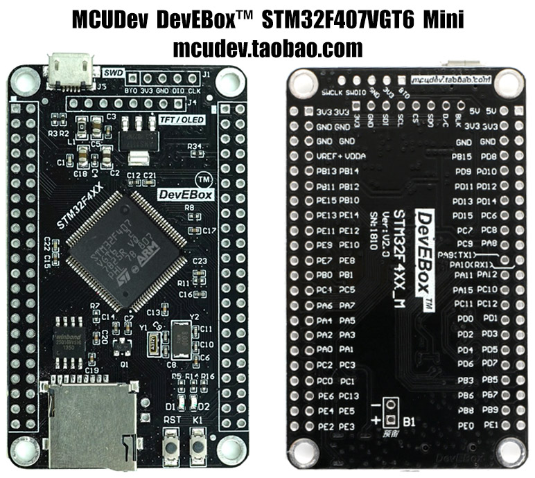</p>


## MCUDev DevEBox STM32F407VGT6 (MCU a Flashear)
Principales caracterissticas:
Cortex-M4, 168 MHz, 1024 KB Flash(la "G" lo indica), 192 KB SRAM

| Función | Configuración |
| :--- | :--- |
| **Reloj** | HSE 8 MHz → PLL a 168 MHz, con 48 MHz para USB y SDIO. LSE 32.768 kHz activado |
| **Depuración** | SWD (PA13/PA14) |
| **LED D2** | PA1 LED_D2, arranca apagado porque es activo en bajo |
| **Botón K1** | PA0 KEY_K1, entrada con pull-down |
| **Flash W25Q16** | SPI1 (PB3/PB4/PB5) y PA15 FLASH_CS |
| **TFT/OLED J4** | SPI2 (PB13/14/15) y PB12 TFT_CS, PC5 TFT_RS, PB1 TFT_BLK |
| **microSD** | SDIO de 4 bits + FATFS |
| **USB** | OTG FS en modo dispositivo CDC (puerto COM virtual) |
| **Consola serie** | USART1 a 115200 (PA9 TX / PA10 RX) |

> :memo: **Note:** El Puerto USB del STM32F407VGT6 no permite depurar (sin breakpoints ni ejecución paso a paso), solo grabar ***SOLO*** si se pone el MCU en modo DFU. NO se puede usar ST links ni otro hardaware en el puerto serial para flashear, en ese caso se usa los pines del puerto J1 para poner un hardware para flashear como el ST links o sus variantes.


## STM32CubeMX

> :bulb: **Tip:** Podemos copiar el perfil predeterminado ya creado para este STM32 llamado ```DevEBox_F407VGT6_base.ioc``` o ```DevEBox_F407VGT6_base_FreeRTOS.ioc``` (si se trabaja con FreeRTOS) en la carpeta de trabajo.
> 
> El nombre de este archivo determina el nombre del archivo compilado


1. `File > Open Folder`, elegir la carpeta del proyecto generado (STM32-Projects)
2. Crear el proyecto base (CubeMX embebido). En VScode el ícono de STM32Cube en la barra lateral de VS Code, click en **"Launch STM32CubeMX"**
3. En CubeMX: **Access to MCU Selector** (no "Board Selector", porque la DevEBox no es una placa oficial de ST con BSP propio) → buscar **STM32F407VET6** → **Start Project**.
4. Confirmar inicialización de periféricos en modo default cuando lo pida (dejamos GPIO/RCC en default, se ajusta en el paso 3 de este documento).
5. Pestaña **Project Manager**:
   - Project Name: `stm32_name`
   - Toolchain / IDE: **CMake**
   - Linker settings: default
6. **GENERATE CODE**.

<p align="center">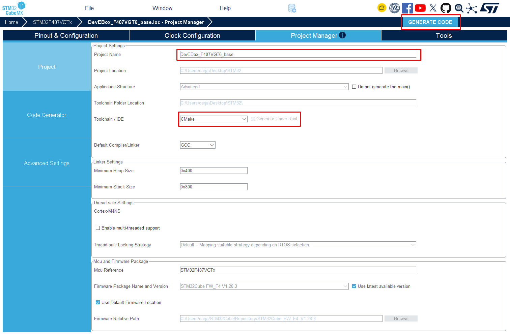</p>

> :warning: **Warning:** 
> * FATFS mostrará un aviso porque falta el pin de detección de tarjeta. Es normal, esta placa no lo tiene.
> * Hay un fallo conocido del HAL en el F4: HAL_SD_Init falla con bus de 4 bits. Si la SD no monta, en MX_SDIO_SD_Init() cambia BusWide a SDIO_BUS_WIDE_1B. HAL_SD_ConfigWideBusOperation pasa después a 4 bits.
> * El LED es activo en bajo, así que se enciende con HAL_GPIO_WritePin(LED_D2_GPIO_Port, LED_D2_Pin, GPIO_PIN_RESET).


## Output STM32CubeMX

```
MiProyecto/
├── CMakeLists.txt                    ← descripción del proyecto
├── CMakePresets.json                 ← configuraciones Debug/Release predefinidas
├── cmake/
│   ├── gcc-arm-none-eabi.cmake       ← le dice a CMake que use el compilador ARM
│   └── stm32cubemx/CMakeLists.txt    ← archivos que gestiona CubeMX (no editar)
├── Core/ 
│       ├── Inc/                       ← tus headers + los que genera CubeMX (main.h, stm32f4xx_hal_conf.h...)
│       │   └── files.h
│       │ 
│       └── Src/                       ← tus .c + main.c, stm32f4xx_it.c (interrupciones), etc.
│           └── files.c
├── Drivers/ 
│   ├── CMSIS/                        ← headers del core ARM Cortex-M4 (no lo tocás nunca)
│   └── STM32F4xx_HAL_Driver/         ← la librería HAL completa (Inc/ y Src/, tampoco se toca) 
├── Middlewares/
│   └── Third_Party/FreeRTOS/         ← el kernel de FreeRTOS que agrega CubeMX al habilitarlo
├── DevEBox_F407VGT6_base.ioc         ← configuration STM32CubeMX
└── STM32F407XX_FLASH.ld              ← linker script
```

Generar proyectos para CMake para poder trabajar con VSCode

**¿Qué es CMake?** Una herramienta que lee un archivo de texto llamado `CMakeLists.txt`, donde se describe qué archivos fuente tiene el proyecto, qué opciones de compilación usar y qué ejecutable crear. A partir de ahí genera las instrucciones de compilación para Make o **Ninja**, que hacen la compilación en sí.

**¿Por qué elegirlo en vez de STM32CubeIDE?**

- **Independiente del editor:** puedes usar VS Code (con la extensión oficial "STM32Cube for VS Code"), CLion o cualquier otro.
- **Automatizable:** compilas desde la terminal, lo que sirve para integración continua y scripts.
- **Estándar:** CMake se usa en todo el mundo del C/C++, no solo en STM32.

### Archivos de compilación (CMake) 

* ```CMakeLists.txt```: la "receta" principal del proyecto. Define el nombre, el lenguaje y qué archivos se compilan. CubeMX lo crea una vez y no lo vuelve a sobrescribir.

* ```CMakePresets.json```: configuraciones listas para compilar. Debug es para desarrollar y depurar (sin optimizaciones y con información para el depurador). Release es para la versión final (optimizada, más pequeña y más rápida). Es lo que eliges cuando VS Code te pregunta por un preset.

* ```cmake/gcc-arm-none-eabi.cmake```: le indica a CMake que no use el compilador de tu PC sino arm-none-eabi-gcc, el que genera código para el Cortex-M4. También fija opciones del chip, como -mcpu=cortex-m4 y la FPU.

* ```cmake/stm32cubemx/CMakeLists.txt```: la lista de archivos que agregó CubeMX (drivers HAL, middlewares, main.c, etc.). No lo edites: se regenera cada vez que pulsas Generate Code.

### Codigo

```Core/Inc — Headers (.h)```: Contiene las declaraciones, prototipos de funciones, #define, structs, tipos. Es lo que un archivo necesita ver para usar una función sin conocer cómo está implementada.

```Core/Src — Código fuente (.c)```: Contiene la implementación real: el cuerpo de las funciones, la lógica.


* ```Core/Inc/```: los .h correspondientes. Destacan main.h, con los nombres de los pines (por ejemplo LED_D2_Pin), y stm32f4xx_hal_conf.h, que define qué módulos de la HAL se incluyen.
* ```Core/Src/```: los .c de la aplicación.
  * ```main.c```: el punto de entrada. Contiene la inicialización del reloj y los periféricos, y el ```while(1) principal```. Aqui va mi programación principal.
  * ```stm32f4xx_it.c```: las rutinas de interrupción (SysTick, UART, DMA…).
  * ```stm32f4xx_hal_msp.c```: la configuración de bajo nivel de cada periférico (qué pines usa, qué relojes enciende).
  * ```system_stm32f4xx.c```: el arranque del reloj del sistema, antes de main().
  * ```syscalls.c y sysmem.c```: el soporte para funciones de C como printf y malloc.


### Código de ST (normalmente no se toca)
* ```Drivers/```: las librerías de ST para el microcontrolador.
  * ```CMSIS/```: definiciones del núcleo ARM y del chip (registros, direcciones de memoria).
  * ```STM32F4xx_HAL_Driver/```: la HAL (Hardware Abstraction Layer), con funciones como HAL_GPIO_TogglePin() o HAL_UART_Transmit().
* ```Middlewares/```: librerías de más alto nivel que activaste en CubeMX. En tu caso: FreeRTOS (el sistema operativo de tiempo real), FatFS (el sistema de archivos para la microSD) y el USB Device (el puerto COM virtual CDC).

### Configuración del hardware
* ```DevEBox_F407VGT6_base.ioc```: el archivo de STM32CubeMX. Guarda la configuración gráfica del chip: pines, relojes, periféricos, DMA y FreeRTOS. Si cambias algo aquí y pulsas Generate Code, CubeMX regenera el código de inicialización.
* ```STM32F407XX_FLASH.ld```: el linker script. Describe la memoria del chip, es decir, dónde empieza la Flash (0x08000000), dónde está la RAM y cuánto espacio hay para el stack y el heap. El linker lo usa para decidir dónde colocar el código y las variables.
* También suele haber un startup_stm32f407xx.s en ensamblador. Es lo primero que se ejecuta al encender el micro: prepara la RAM, define la tabla de interrupciones y luego llama a main().

### La regla más importante

Cuando regeneras con CubeMX, se sobrescriben los archivos de Core/, excepto lo que está entre estos comentarios:
```c
/* USER CODE BEGIN 2 */
// tu código aquí se conserva
/* USER CODE END 2 */
```
<br>

## STM32CubeMX configuraciones importantes
<p align="center">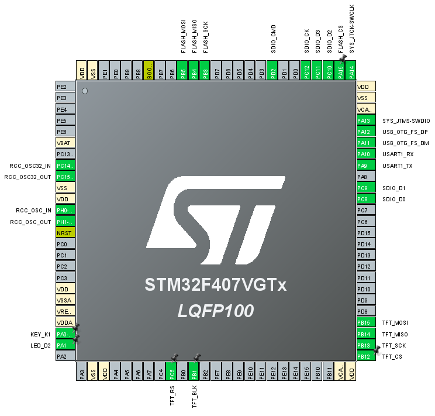</p>
<p align="center">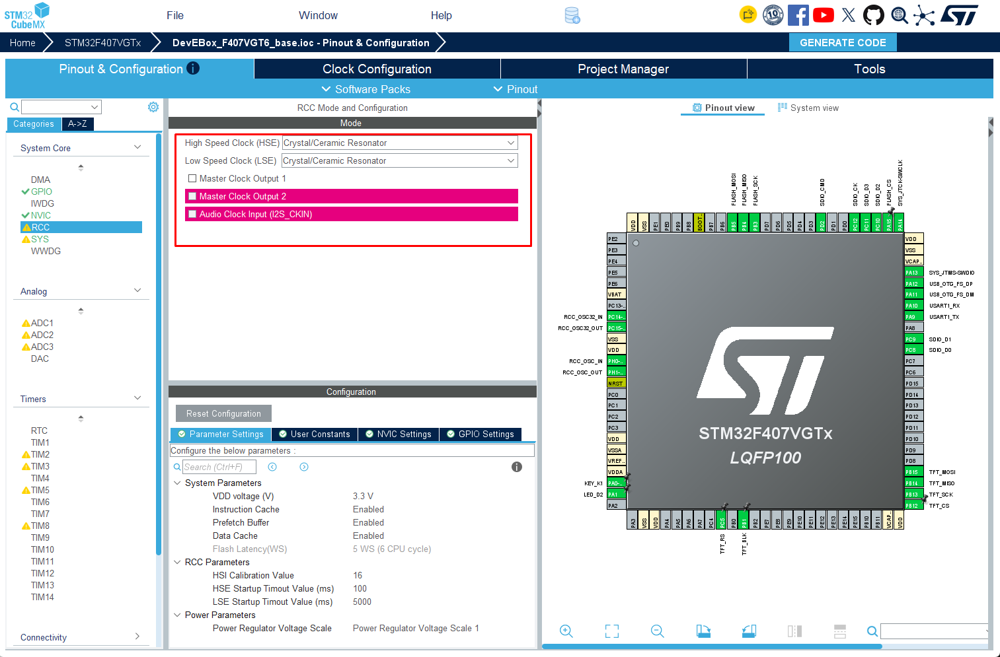</p>
<p align="center">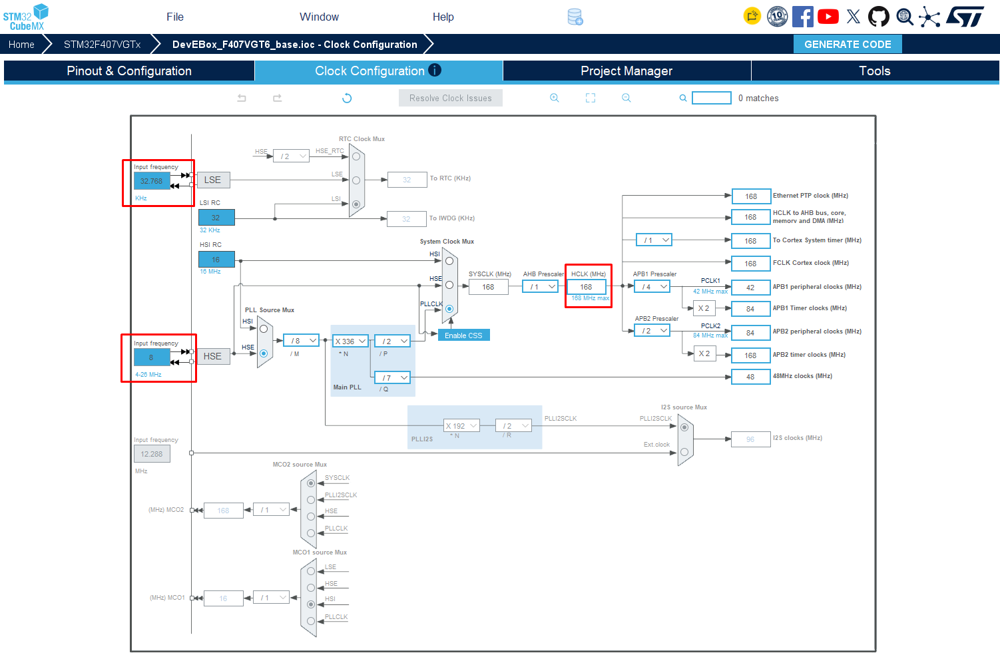</p>
<p align="center">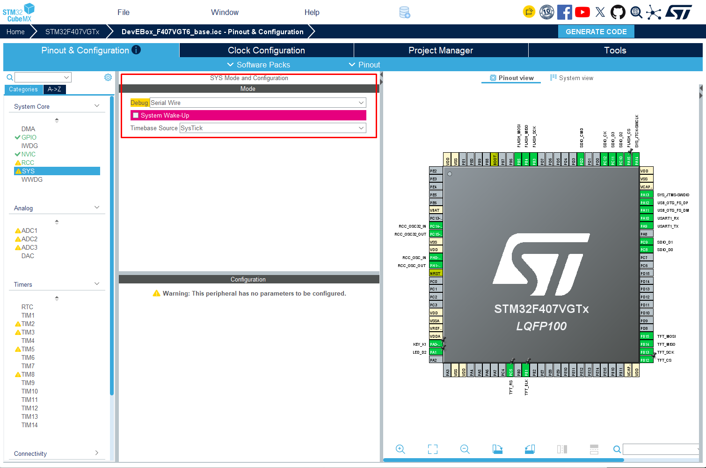</p>

<br>


# Compilation

* Guarda y compila con ```Build (F7)```
* Run and Debug (Ctrl+Shift+D) y pulsa ▶

Una compilación correcta en VScode/Output Termina con:

<p align="center">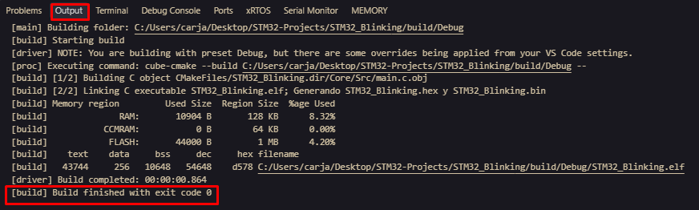</p>

```
[build] Build finished with exit code 0
```
En el panel Output (canal CMake/Build). A demas de mostrar un resumen de memoria con el uso de FLASH y RAM.


* Genera los archivos compilados (dependiendo a como este configurado):
```
  build/Debug/<nombre>.elf
  build/Debug/<nombre>.hex
  build/Debug/<nombre>.bin
```  
* Deja el panel Problems (Ctrl+Shift+M) sin errores en rojo. Las advertencias no impiden programar.
  
## Cambiar el nombre del ejecutable
1. En el CMakeLists.txt raíz, cambia la línea:
```cmake
set(CMAKE_PROJECT_NAME MiNombre)
```
CubeMX no sobrescribe ese archivo al regenerar, así que el cambio se mantiene.
2. Reconfigura CMake: Ctrl+Shift+P → ***CMake: Delete Cache and Reconfigure***, o borra la carpeta build/.
3. Compila. Ahora obtendrás ***build/Debug/MiNombre.elf***
4. Si ya tienes un ***.vscode/launch.json***, actualiza ahí la ruta del .elf, porque si no el depurador buscará el archivo con el nombre antiguo.

## Output .elf | .hex | .bin en la compilación
Despues de compilar solo se genera el archivo .elf porque no hay un botón o casilla para esto en la extensión de VS Code. Esa salida se define en el archivo ```CMakeLists.txt```, una alternativa para forzar dichas salidas:

Crea una vez el archivo ```cmake/outputs.cmake```
```cmake
add_custom_command(TARGET ${CMAKE_PROJECT_NAME} POST_BUILD
    COMMAND ${CMAKE_OBJCOPY} -O ihex   $<TARGET_FILE:${CMAKE_PROJECT_NAME}> ${CMAKE_PROJECT_NAME}.hex
    COMMAND ${CMAKE_OBJCOPY} -O binary $<TARGET_FILE:${CMAKE_PROJECT_NAME}> ${CMAKE_PROJECT_NAME}.bin
    COMMAND ${CMAKE_SIZE} $<TARGET_FILE:${CMAKE_PROJECT_NAME}>
    COMMENT "Generando ${CMAKE_PROJECT_NAME}.hex y .bin"
)
```
Qué hace cada línea:

* ```-O ihex``` genera el .hex (formato Intel HEX).
* ```-O binary``` genera un .bin. Es opcional; si no lo quieres, borra esa línea.
* ```${CMAKE_SIZE}``` muestra al final cuánta Flash y RAM usa el programa.

Luego, en cada proyecto nuevo, copias ese archivo a su carpeta ```cmake/``` y agregas una sola línea al final del ```CMakeLists.txt raíz```:

```cmake
include(cmake/outputs.cmake)
```


<br>

<br>

# How to STM32F407VGT6 Flashear
Recomendaciones:
1. Para evitar problemas con los driver DFU es recomendable instalar ```STM32CubeProgrammer``` que instala esos driver 
2. Instala los driver de ```C:\Users\carja\AppData\Local\stm32cube\bundles\programmer\2.23.0\Drivers\DFU_Driver\``` ejecuta el .bat o .exe de esa carpeta como administrador" 


```- Hay 3 Formas de flashear los STM32 - ```

## Programación por USB (bootloader DFU sin el programador ST-LINK) (Opcion 1)
El STM32F407 trae de fábrica un bootloader que acepta programación por el USB de la placa (permite grabar el chip directamente por USB):

> :warning: **Warning:** Esta opción no permite depurar (sin breakpoints ni ejecución paso a paso), solo grabar. Si Windows no reconoce el dispositivo "STM32 BOOTLOADER", instala los drivers desde STM32Cube Resources → Install ST-Link USB drivers.

### Bootloader DFU & STM32CubeProgrammer (Flashing via DFU)

1. Pon la placa en modo bootloader: coloca BOOT0 en 1 (en la DevEBox suele ser un jumper o un par de pines marcados BOOT0 que se unen a 3.3V). Conecta el micro-USB de la placa al PC, o pulsa RESET si ya estaba conectada.
2. Correr STM32CubeProgrammer y seleccionar USB en vez de ST Link, Actualizar Puerto en USB Configuration (darle unos segundos), debe detectar algo asi como ```USB1```

<p align="center">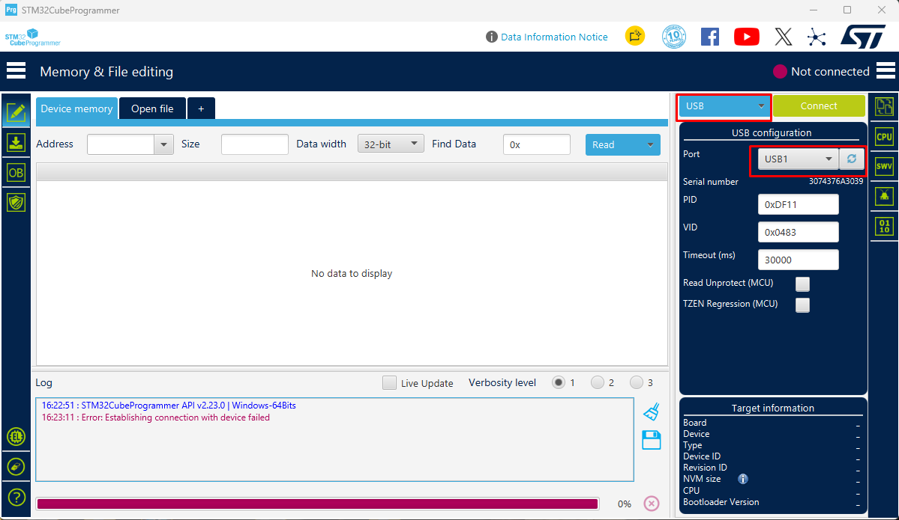</p>

3. En ```+``` Open file -> cargar el archivo ```.efl```

<p align="center">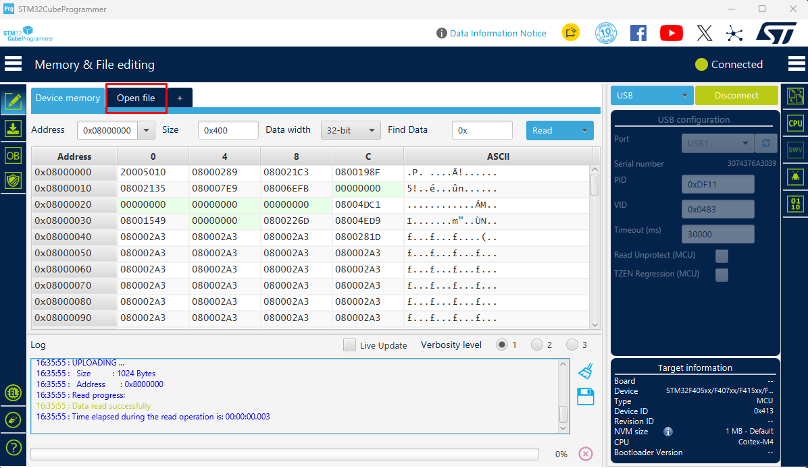</p>

4. Download

<p align="center">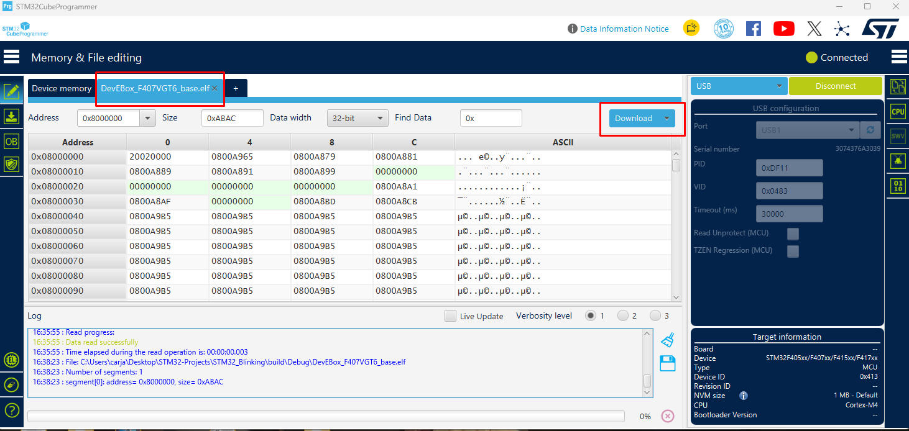</p>

5. Si no hay mensaje de error esta listo
6. Vuelve BOOT0 a 0 y RST para que arranque el programa.


### Formatos de archivo para flashear con STM32CubeProgrammer

STM32CubeProgrammer acepta **.elf**, **.hex** y **.bin**. El resultado en el chip es el mismo; la diferencia es cuánta información trae cada archivo sobre **dónde** grabar.

| Formato | ¿Incluye la dirección? | Cómo se usa |
|---|---|---|
| **.elf** | Sí, además de símbolos de depuración | Directo: `-w programa.elf` |
| **.hex** | Sí | Directo: `-w programa.hex` |
| **.bin** | **No**, son solo los bytes en bruto | Hay que indicar la dirección: `-w programa.bin 0x08000000` |

#### Recomendado: usar el `.elf`

Es el que genera la compilación sin configurar nada extra, ya lleva las direcciones y no hay forma de equivocarse:

```bash
STM32_Programmer_CLI -c port=USB1 -w build/Debug/<nombre>.elf -v
```

#### Cuándo usar los otros formatos

- **.hex**: para entregar el firmware a otra persona, herramienta o programador de producción. Es texto, lleva las direcciones y lo aceptan casi todas las herramientas.
- **.bin**: para bootloaders propios, actualizaciones OTA o cargas por UART/SD, donde se envían los bytes tal cual. Al grabarlo con CubeProgrammer, **indicar siempre la dirección `0x08000000`** (inicio de la Flash del STM32F407). Sin ella, o con una dirección equivocada, el micro no arranca.

> :memo: **Note:** El `.elf` es el único que sirve para **depurar** (breakpoints, variables), porque es el único que contiene los símbolos del programa.

### Bootloader DFU & Terminal (Flashing via DFU)

1. Pon la placa en modo bootloader: coloca BOOT0 en 1 (en la DevEBox suele ser un jumper o un par de pines marcados BOOT0 que se unen a 3.3V). Conecta el micro-USB de la placa al PC, o pulsa RESET si ya estaba conectada.
   
2. Verifica que Windows la detecta:
```bash
STM32_Programmer_CLI -l usb
```

<p align="center">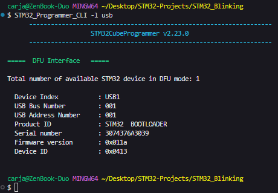</p>

Debe aparecer USB1 con "DFU in HS Mode" o similar. Si dice que no hay dispositivos, instala el driver DFU que viene con el programador. desconecta y vuelve a conectar la placa. En el Administrador de dispositivos debería aparecer como "STM32 BOOTLOADER".

3. Grabar desdes el ```STM32CubeProgrammer``` o desde el Terminal:
```bash
STM32_Programmer_CLI -c port=USB1 -w build/Debug/<NAME-FILE>.elf -v
```
> :bulb: **Tip:** STM32_Programmer_CLI acepta el .elf directamente
4. Vuelve BOOT0 a 0 y reinicia para que arranque tu programa.

<br>

### En caso de Error

> :warning: **Warning:** En caso de que el comando no funcione ```bash: STM32_Programmer_CLI: command not found``` el problema generalmente es el PATH

Buscala la App desde GitBash:
```bash
find /c/Users/carja/AppData/Local/stm32cube/bundles -name "STM32_Programmer_CLI.exe"
#sample: /c/Users/carja/AppData/Local/stm32cube/bundles/programmer/2.23.0/bin/STM32_Programmer_CLI.exe
```

Agregar el PATH con la ruta que te entrego, solo la carpeta sin el *.exe
```bash
export PATH="$PATH:/c/Users/carja/AppData/Local/stm32cube/bundles/programmer/2.23.0/bin/"
```
Para no tener de nuevo el problema con el PATH:
```bash
echo 'export PATH="$PATH:/c/Users/carja/AppData/Local/stm32cube/bundles/programmer/2.23.0/bin"' >> ~/.bashrc
```

Testing:
```bash
STM32_Programmer_CLI --version
STM32_Programmer_CLI -l                 # Detecta el Hardware
STM32_Programmer_CLI -c port=SWD
```


## Usar el programador STlinkV2 original / ARM_KEIL-uVision (Opcion 2)

> :warning: **Warning:** el STM32CubeIDE da problemas para flashear MPU no originales, se debe usar:
> * STM32CubeProgrammer (STM32CubeIDE) no hace debugger a los clones 
> * ARM_KEIL-uVision (MDK-ARM) con este ultimo me permite programar y hacer debugger a los clones de STM32


## Usar Zadig (Opcion 3)
Zadig es una herramienta pequeña, gratuita y muy usada para instalar el driver USB genérico de Windows (WinUSB), que es el que usa el programador para el modo DFU.
1. Descárgalo desde https://zadig.akeo.ie (es un solo .exe, no requiere instalación).
2. Conecta la placa con BOOT0 en 1, para que aparezca "STM32 BOOTLOADER".
3. Abre Zadig y activa Options → List All Devices.
4. En el desplegable elige STM32 BOOTLOADER. Comprueba que el USB ID sea 0483 DF11.
5. En la casilla de la derecha deja WinUSB y pulsa Install Driver (o Replace Driver). Tarda alrededor de un minuto.
6. Desconecta y vuelve a conectar la placa.

<br>

<br>

# Guía de conceptos: STM32, HAL, CubeMX, FreeRTOS y más

Te explico los términos en el orden en que se usan al trabajar: primero cómo encajan todos, después cada uno en detalle y al final un glosario con otros conceptos que te vas a encontrar.

---

## El panorama general

Programar un microcontrolador STM32 funciona por capas. Cada capa usa la que tiene debajo:

```
┌──────────────────────────────────────────────────────┐
│  TU CÓDIGO  (main.c, tus tareas, tu lógica)          │
├──────────────────────────────────────────────────────┤
│  MIDDLEWARE: FreeRTOS (vía CMSIS-RTOS), FatFs, USB   │
├──────────────────────────────────────────────────────┤
│  STM32Cube HAL / LL  (drivers de periféricos)        │
├──────────────────────────────────────────────────────┤
│  CMSIS-Core  (registros, interrupciones, SysTick)    │
├──────────────────────────────────────────────────────┤
│  HARDWARE: el chip STM32F407VGT6                     │
└──────────────────────────────────────────────────────┘
```

El flujo de trabajo es este:

1. Configuras la placa en **CubeMX**, y esa configuración se guarda en el archivo **.ioc**.
2. CubeMX genera código C usando los archivos del **paquete FW_F4**.
3. Ese código queda organizado para un **toolchain** concreto: STM32CubeIDE, **CMake**, Keil, etc.
4. El compilador lo convierte en un binario, que grabas en la placa con un programador (ST-LINK).

---

## 1. STM32CubeMX

**Definición:** una herramienta gráfica y gratuita de ST para configurar un microcontrolador STM32 sin escribir a mano el código de inicialización.

En CubeMX puedes:

- **Asignar pines** (*Pinout*): decidir qué pin es salida de LED, cuáles son del SPI, cuáles del USB, etc.
- **Configurar el árbol de reloj** (*Clock Configuration*): definir a qué velocidad corre el micro. En la DevEBox son 168 MHz, obtenidos del cristal de 8 MHz.
- **Configurar periféricos**: velocidad del UART, modo del SPI, etc.
- **Activar middleware**: FreeRTOS, FatFs, USB…
- **Generar código**: crea `main.c` con funciones como `MX_GPIO_Init()`, `MX_SPI1_Init()` y `SystemClock_Config()` ya escritas.

**El archivo .ioc** es un archivo de texto que guarda toda esa configuración. Si lo abres con CubeMX, ves todo configurado.

> :warning: **Warning:** cada vez que regeneras código, CubeMX sobrescribe los archivos. Solo respeta lo que escribas entre estos comentarios:

```c
/* USER CODE BEGIN 2 */
   // tu código aquí está a salvo
/* USER CODE END 2 */
```

Todo lo que escribas fuera de esos bloques se pierde al regenerar. Es el error más común de quienes empiezan.

CubeMX existe como programa independiente y también viene integrado dentro de **STM32CubeIDE**.

---

## 2. STM32Cube HAL

**Definición:** HAL significa *Hardware Abstraction Layer*. Es una biblioteca en C escrita por ST que te permite controlar los periféricos del micro con funciones legibles, sin manipular registros directamente.

**¿Qué es un registro?** Una dirección de memoria especial donde cada bit controla algo del hardware. Sin HAL, encender el LED de la placa (PA1, activo en bajo) sería así:

```c
GPIOA->BSRR = (1 << (1 + 16));   // poner PA1 en 0
```

Con HAL es así:

```c
HAL_GPIO_WritePin(GPIOA, GPIO_PIN_1, GPIO_PIN_RESET);
```

Hacen exactamente lo mismo, pero la segunda línea se entiende sin consultar el manual del chip. Además, el mismo código funciona casi igual en otros STM32 (F1, F4, H7…).

### Conceptos clave de HAL

- **Handle (manejador):** una estructura que representa un periférico y guarda su configuración y estado. CubeMX los crea por ti:

```c
  SPI_HandleTypeDef hspi1;    // representa al SPI1
  UART_HandleTypeDef huart1;  // representa al USART1
```

- **Estado de retorno:** casi todas las funciones devuelven `HAL_OK`, `HAL_ERROR`, `HAL_BUSY` o `HAL_TIMEOUT`, así que puedes comprobar si algo falló.

- **Tres modos de operación** para comunicaciones:

  | Modo | Ejemplo | Cómo funciona |
  |---|---|---|
  | **Polling** (bloqueante) | `HAL_UART_Transmit()` | La CPU espera hasta que termina. Es simple, pero la CPU queda ocupada mientras tanto |
  | **Interrupción** | `HAL_UART_Transmit_IT()` | Arranca la operación y sigue. El hardware avisa cuando termina |
  | **DMA** | `HAL_UART_Transmit_DMA()` | Un circuito aparte mueve los datos sin usar la CPU. Es lo más eficiente |

- **Callbacks:** funciones que la HAL llama automáticamente cuando ocurre algo, por ejemplo al terminar una recepción. Tú las escribes con el nombre exacto:

```c
  void HAL_UART_RxCpltCallback(UART_HandleTypeDef *huart) {
      // se ejecuta cuando llegó un dato por UART
  }
```

- **MSP** (*MCU Support Package*): funciones como `HAL_SPI_MspInit()`, en el archivo `stm32f4xx_hal_msp.c`. Configuran lo de más bajo nivel de cada periférico: activar su reloj y asignar sus pines. CubeMX las genera.

**HAL frente a LL:** ST ofrece también los drivers **LL** (*Low-Layer*). Están más cerca del registro, son más rápidos y ocupan menos memoria, pero son más difíciles de usar. Para empezar, usa HAL.

---

## 3. "Comandos" HAL

Técnicamente son **funciones** en C, no comandos. Todas siguen el patrón `HAL_<Periférico>_<Acción>()`. Estas son las que más vas a usar:

```c
/* --- Sistema --- */
HAL_Init();                         // inicializa la HAL (lo llama main() al inicio)
HAL_Delay(500);                     // espera 500 ms (bloqueante)
uint32_t t = HAL_GetTick();         // milisegundos desde el arranque

/* --- GPIO (pines) --- */
HAL_GPIO_WritePin(LED_D2_GPIO_Port, LED_D2_Pin, GPIO_PIN_RESET); // LED encendido
HAL_GPIO_WritePin(LED_D2_GPIO_Port, LED_D2_Pin, GPIO_PIN_SET);   // LED apagado
HAL_GPIO_TogglePin(LED_D2_GPIO_Port, LED_D2_Pin);                // invierte el estado
GPIO_PinState b = HAL_GPIO_ReadPin(KEY_K1_GPIO_Port, KEY_K1_Pin); // lee el botón

/* --- UART (puerto serie) --- */
HAL_UART_Transmit(&huart1, (uint8_t*)"Hola\r\n", 6, 100);   // envía, timeout 100 ms
HAL_UART_Receive(&huart1, buffer, 10, 1000);                 // recibe 10 bytes

/* --- SPI (flash W25Q16, pantalla) --- */
HAL_GPIO_WritePin(FLASH_CS_GPIO_Port, FLASH_CS_Pin, GPIO_PIN_RESET); // seleccionar chip
HAL_SPI_TransmitReceive(&hspi1, tx, rx, 4, 100);
HAL_GPIO_WritePin(FLASH_CS_GPIO_Port, FLASH_CS_Pin, GPIO_PIN_SET);   // soltar chip
```

Nombres como `LED_D2_Pin` o `FLASH_CS_GPIO_Port` existen porque en el .ioc los pines tienen etiquetas. CubeMX las convierte en `#define` dentro de `main.h`, y así el código queda legible.

**Dónde aprender más:** el documento oficial se llama **UM1725, "Description of STM32F4 HAL and low-layer drivers"**, y describe cada función. También puedes leer los comentarios que hay dentro de los archivos `stm32f4xx_hal_xxx.c`.

---

## 4. Paquete FW_F4 (STM32CubeF4)

**Definición:** el "paquete de firmware" oficial de ST para toda la familia STM32F4. Su nombre completo es **STM32CubeF4**, y cada familia tiene el suyo (FW_F1, FW_H7…).

Contiene:

- **Drivers HAL y LL** para todos los periféricos del F4.
- **CMSIS**: los archivos base de ARM y ST, como definiciones de registros y código de arranque.
- **Middleware**: FreeRTOS, FatFs, las librerías USB Device/Host, LwIP (red TCP/IP) y otras.
- **BSP** (*Board Support Package*): drivers para las placas oficiales de ST. No aplica a placas chinas.
- **Cientos de ejemplos** de proyectos. Son muy útiles para aprender.

**Cómo se usa:** CubeMX lo descarga una sola vez, en una carpeta llamada `STM32Cube/Repository`. Al generar tu proyecto, copia solo los archivos necesarios a las carpetas `Drivers/` y `Middlewares/` de tu proyecto.

**Versiones:** se identifican como "FW_F4 V1.28.1", por ejemplo. Si abres un proyecto hecho con otra versión del paquete, CubeMX te ofrece "migrarlo" para actualizarlo. Aceptar es seguro.

---

## 5. Toolchain

**Definición:** el conjunto de herramientas que convierte tu código C en un programa que el micro puede ejecutar.

| Herramienta | Qué hace | En STM32 normalmente es… |
|---|---|---|
| **Compilador** | Convierte cada `.c` en código máquina | `arm-none-eabi-gcc` (GCC para ARM) |
| **Enlazador (linker)** | Une todo y decide en qué dirección de memoria va cada cosa, según el *linker script* (`.ld`) | `arm-none-eabi-ld` |
| **Conversor** | Pasa el `.elf` a `.bin` o `.hex` para grabar | `arm-none-eabi-objcopy` |
| **Programador / depurador** | Graba el chip y te permite detener el programa, ver variables, etc. | ST-LINK + GDB |
| **Sistema de construcción** | Decide qué compilar y en qué orden | Make, **CMake**, Ninja |
| **IDE** (opcional) | Editor con todo integrado | STM32CubeIDE, VS Code, Keil, IAR |

**Compilación cruzada:** compilas en tu PC (x86) para otro procesador (ARM Cortex-M4). Por eso el compilador se llama `arm-none-eabi-gcc`: "arm" es el procesador de destino y "none" indica que no hay sistema operativo.

En CubeMX, la opción **Project Manager → Toolchain/IDE** no instala nada. Solo decide **qué archivos de proyecto genera**: un proyecto de STM32CubeIDE, un `CMakeLists.txt`, un proyecto de Keil, etc.

---

## 6. Generar proyectos para CMake

**¿Qué es CMake?** Una herramienta que lee un archivo de texto llamado `CMakeLists.txt`, donde se describe qué archivos fuente tiene el proyecto, qué opciones de compilación usar y qué ejecutable crear. A partir de ahí genera las instrucciones de compilación para Make o **Ninja**, que hacen la compilación en sí.

**¿Por qué elegirlo en vez de STM32CubeIDE?**

- **Independiente del editor:** puedes usar VS Code (con la extensión oficial "STM32Cube for VS Code"), CLion o cualquier otro.
- **Automatizable:** compilas desde la terminal, lo que sirve para integración continua y scripts.
- **Estándar:** CMake se usa en todo el mundo del C/C++, no solo en STM32.

**Qué genera CubeMX** cuando eliges CMake:

```
MiProyecto/
├── CMakeLists.txt          ← descripción del proyecto
├── CMakePresets.json       ← configuraciones Debug/Release predefinidas
├── cmake/
│   ├── gcc-arm-none-eabi.cmake  ← le dice a CMake que use el compilador ARM
│   └── stm32cubemx/CMakeLists.txt  ← archivos que gestiona CubeMX (no editar)
├── Core/  Drivers/  Middlewares/
└── STM32F407XX_FLASH.ld    ← linker script
```

**Para compilar desde la terminal:**

```bash
cmake --preset Debug           # configura (una vez)
cmake --build --preset Debug   # compila → build/Debug/MiProyecto.elf
```

**Qué necesitas instalar:** **STM32CubeCLT** (*Command Line Toolset*), el paquete de ST que trae el compilador ARM, las herramientas para grabar y depurar, y en versiones recientes también CMake y Ninja. Para quien empieza, lo más cómodo es **VS Code con la extensión STM32Cube**, que configura todo esto por ti.

Si prefieres algo que funcione de una vez sin configurar nada, usa STM32CubeIDE. Puedes pasarte a CMake más adelante.

---

## 7. SysTick

**Definición:** un temporizador de 24 bits que viene **dentro del núcleo ARM Cortex-M**. No es un periférico de ST, así que existe en cualquier Cortex-M de cualquier fabricante. Su función es generar una interrupción periódica, como el "latido" del sistema.

**Cómo lo usa la HAL:** en un proyecto sin RTOS, la HAL lo configura para interrumpir cada **1 ms**. En cada interrupción incrementa un contador (`uwTick`). En eso se basan:

- `HAL_GetTick()`, que devuelve ese contador.
- `HAL_Delay(n)`, que espera hasta que el contador avance n.
- Los *timeouts* de funciones como `HAL_UART_Transmit(..., 100)`.

**El conflicto con FreeRTOS:** FreeRTOS también necesita el SysTick para su propio latido (el *tick* del sistema operativo), y dos dueños del mismo temporizador causan problemas. Por eso, en un proyecto con FreeRTOS la HAL usa otro temporizador (por ejemplo **TIM6**, un temporizador normal del STM32) como base de tiempo, y el SysTick queda solo para FreeRTOS. Se configura en *SYS → Timebase Source*, y CubeMX te muestra un aviso si no haces este cambio.

---

## 8. FreeRTOS

**Definición:** un **sistema operativo en tiempo real** (RTOS, *Real-Time Operating System*) pequeño, gratuito y de código abierto (licencia MIT), mantenido por Amazon. Es el más usado en microcontroladores.

**¿Por qué hace falta?** Sin RTOS, un programa embebido típico es un **superloop**:

```c
while (1) {
    leer_boton();
    parpadear_led();      // si esto usa HAL_Delay(500)...
    atender_usb();        // ...esto queda esperando medio segundo
}
```

El problema es que si una parte espera o tarda, todo lo demás se detiene.

**Con FreeRTOS** divides el programa en **tareas** (*tasks*) independientes. Cada una parece tener su propio `while(1)`:

```c
void StartLedTask(void *argument) {
    for (;;) {
        HAL_GPIO_TogglePin(LED_D2_GPIO_Port, LED_D2_Pin);
        osDelay(500);     // cede la CPU a otras tareas durante 500 ms
    }
}
```

El **planificador** (*scheduler*) reparte la CPU entre las tareas. Lo hace tan rápido que parecen ejecutarse al mismo tiempo.

### Conceptos clave

| Concepto | Qué es |
|---|---|
| **Tarea** | Una función con su propio `for(;;)` y su propia pila de memoria (*stack*) |
| **Prioridad** | Número que indica qué tarea gana si dos quieren la CPU a la vez. La de mayor prioridad siempre corre primero |
| **Tick** | El latido del RTOS (1 ms por defecto), generado por el SysTick |
| **Estados** | Una tarea puede estar *Running* (ejecutándose), *Ready* (lista, esperando turno) o *Blocked* (esperando tiempo o un evento) |
| **Cola** (*queue*) | Forma segura de pasar datos entre tareas |
| **Semáforo** | Señal para avisar a una tarea de que ocurrió algo (por ejemplo, desde una interrupción) |
| **Mutex** | "Candado" para que dos tareas no usen el mismo recurso a la vez, como el SPI o el UART |
| **Heap** | Memoria de donde FreeRTOS saca espacio para crear tareas y colas |
| **Stack overflow** | Cuando una tarea usa más pila de la asignada. Es un error grave, y FreeRTOS puede detectarlo si activas la opción |

**Regla importante:** dentro de una tarea, usa **`osDelay()`** (o `vTaskDelay()`) y **no** `HAL_Delay()`. `HAL_Delay` desperdicia la CPU dando vueltas; `osDelay` la libera para que trabajen otras tareas.

---

## 9. CMSIS-RTOS

Primero hay que entender **CMSIS** (*Cortex Microcontroller Software Interface Standard*): un conjunto de estándares creados por **ARM**, el diseñador del núcleo, para que el software sea compatible entre fabricantes. Tiene varias partes:

- **CMSIS-Core:** definiciones básicas del núcleo (registros, control de interrupciones con el NVIC, SysTick). Está en todos los proyectos STM32.
- **CMSIS-RTOS:** una **API estándar** (conjunto de nombres de funciones) para sistemas operativos.

**CMSIS-RTOS es una capa de traducción.** Define funciones con nombres genéricos, y por debajo llaman a FreeRTOS:

| CMSIS-RTOS v2 (lo que genera CubeMX) | FreeRTOS nativo (lo que se ejecuta realmente) |
|---|---|
| `osThreadNew()` | `xTaskCreate()` |
| `osDelay()` | `vTaskDelay()` |
| `osMessageQueueNew()` | `xQueueCreate()` |
| `osMutexAcquire()` | `xSemaphoreTake()` |

**¿Por qué existe?** En teoría, si tu código usa solo funciones `os...`, podrías cambiar FreeRTOS por otro RTOS (como Keil RTX) sin reescribirlo. En la práctica, CubeMX envuelve FreeRTOS en CMSIS-RTOS por defecto, y hay dos versiones: **v1** (antigua) y **v2** (la actual).

Puedes mezclar ambas: usar `osDelay()` y también llamar funciones nativas de FreeRTOS cuando lo necesites. Casi todos los tutoriales de internet usan las nativas (`xTaskCreate`, etc.), así que conviene saber que son equivalentes.

---

## 10. FATFS (FatFs)

**Definición:** un módulo de **sistema de archivos FAT** gratuito, escrito por un desarrollador japonés conocido como ChaN. Permite leer y escribir **archivos y carpetas** en una memoria (por ejemplo, una microSD) usando el mismo formato que tu PC: FAT16, FAT32 y exFAT.

**¿Por qué hace falta?** Una tarjeta SD, a bajo nivel, es solo un montón de bloques de 512 bytes numerados. FatFs organiza esos bloques en archivos con nombre. Así, lo que guarde tu STM32 lo puedes abrir en Windows como un `.txt` normal, y al revés.

**Funciones principales** (parecidas a las de C estándar):

```c
FATFS fs;  FIL archivo;  UINT escritos;

f_mount(&fs, "", 1);                                    // "montar" la tarjeta
f_open(&archivo, "datos.txt", FA_WRITE | FA_CREATE_ALWAYS);
f_write(&archivo, "Temperatura: 23.5\n", 18, &escritos);
f_close(&archivo);                                      // ¡siempre cerrar!
```

**Cómo se conecta con el hardware:** FatFs no sabe nada del STM32. Usa una capa llamada **diskio** (`disk_read`, `disk_write`…) que CubeMX implementa por ti usando el **SDIO** y la HAL (archivos `sd_diskio.c` y `bsp_driver_sd.c`). En CubeMX, esa conexión se elige en "FATFS → SD Card".

**Opciones que aparecen en CubeMX:**

- `_USE_LFN` (*Long File Names*): permite nombres largos como `mi_registro_2026.txt`. Sin esta opción, el nombre queda limitado a 8 caracteres más la extensión (`DATOS.TXT`).
- `_MAX_SS`: tamaño de sector, 512 bytes para tarjetas SD.

---

## Glosario de conceptos relacionados

- **Periférico:** cada bloque de hardware dentro del chip con una función específica: GPIO, UART, SPI, I2C, SDIO, USB, temporizadores (TIM), ADC…
- **GPIO:** pin de propósito general que puede funcionar como entrada o salida digital.
- **UART/USART:** comunicación serie de 2 hilos (TX/RX). Sirve para imprimir mensajes a tu PC con un adaptador USB-serie.
- **SPI:** bus serie rápido de 4 hilos (SCK, MOSI, MISO, CS). Lo usan memorias flash y pantallas.
- **SDIO:** interfaz dedicada para tarjetas SD, más rápida que usar SPI.
- **USB CDC:** hace que la placa aparezca en tu PC como un puerto COM virtual.
- **Interrupción:** mecanismo por el que el hardware detiene momentáneamente tu programa para atender un evento urgente. El **NVIC** es el controlador de interrupciones del núcleo.
- **DMA:** controlador que copia datos entre memoria y periféricos sin usar la CPU.
- **Árbol de reloj (clock tree):** cómo se deriva la frecuencia de cada parte del chip. **HSE** es el cristal externo (8 MHz en la DevEBox), **PLL** el multiplicador que lo sube a 168 MHz y **LSE** el cristal de 32.768 kHz para el reloj de tiempo real (RTC).
- **.elf / .hex / .bin:** formatos del programa compilado. El `.elf` contiene además información de depuración.
- **Linker script (.ld):** archivo que le indica al enlazador cuánta memoria Flash y RAM tiene el chip y dónde va cada cosa.
- **ST-LINK:** el programador y depurador de ST. Se conecta por **SWD** (2 hilos: SWDIO y SWCLK).
- **BOOT0 / DFU:** modo de arranque que permite grabar el chip directamente por USB, sin ST-LINK.
- **Firmware:** el programa que corre en el microcontrolador.
- **Bare-metal:** programar sin sistema operativo, es decir, con el superloop.


<br>


# Links
https://stm32-base.org/

Mi placa: https://stm32-base.org/boards/STM32F407VGT6-STM32F4XX-M.html 


<br>

<br>

---

<div>
  <p>
     Copyright &nbsp;&copy; 2023 Instinto Digital <a href="https://carjavi.github.io/" title="carjavi.github">carjavi</a>
  </p>
</div>

<p align="center">
    <a href="https://instintodigital.net/" target="_blank"></a>
</p>

